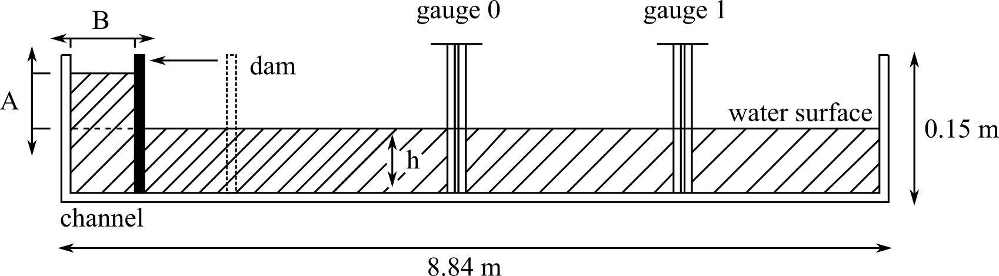
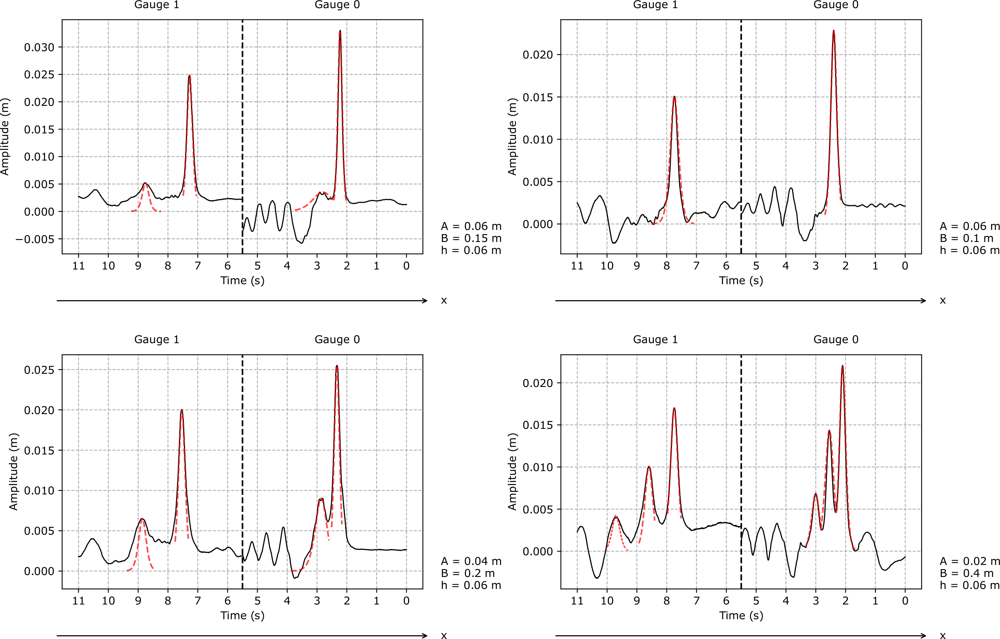
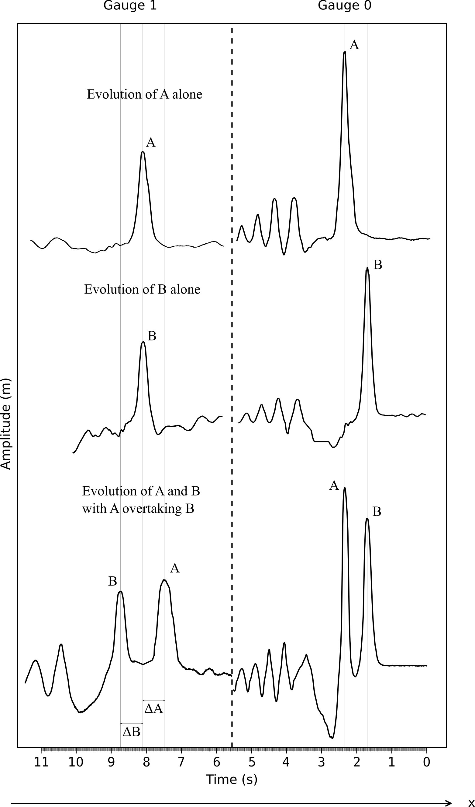

# Overview
This repository contains the data, code, and resulting paper on water soliton propagation produced at University College Dublin as part of my theoretical physics laboratory work. To quote [the paper's](solitary%20waves%20in%20shallow%20water.pdf) abstract,

> Following a brief exploration of the theory of solitons, we demonstrate that 7 primary predictions
of the solitary solution to the KdV equation hold for a set of 67 nonlinear waves in water, provided
their Ursell number is sufficiently low. In particular, we derive the relationship between amplitude
and speed for a set of 38 solitons, derive the phase shift of solitary water waves in catch-up collisions,
and observe the number of waves which evolve from a given set of initial conditions, and demonstrate
that these are in agreement with soliton theory within stated uncertainties.

The apparatus consisted of a 8.84 m wave tank, as in the diagram below, where water height and voltage data was collected by interfacing through Python with a National Instruments USB-6008 device connected to two gauges (0 and 1).

The [code and subsequent data analysis](water-solitons.ipynb) produced a number of interesting figures and plots. For the complete figures, data, and code, see [the paper](solitary%20waves%20in%20shallow%20water.pdf).

# Figures

Below is a sample of some of the more visually interesting figures produced as part of this work.

FIG. 7. Relative difference of the measured speed $c_{sp}$ from the characteristic speed $c_{0}$ versus the relative average amplitude
$⟨η0⟩/h$ for a sample of 38 solitons (see Table. I) at a water depth $h$ = 0.06 m (note that only the largest soliton from each run
was taken for simplicity). Theoretical is the prediction of Eq. 8.

FIG. 8. The one-soliton KdV equation solution (Eq. 7) plotted (red) on top of each of the 8 solitons produced in 4 runs of
the experiment, with $η_0$ adjusted to the observed max amplitude of the soliton. Waves reach gauge 0 first before continuing
towards gauge 1; waves at each gauge are moving left to right.

FIG. 9. (Top) Evolution of an initial disturbance A (run 2 in Table. I) of height $A$ = 0.05 m, length $B$ = 0.15 m, without
collision with another solitary wave. (Middle) Evolution of an initial disturbance **B** (run 17 in Table. I) of height $A$ = 0.06 m,
length $B$ = 0.1 m, without collision with another solitary wave. (Bottom) Evolution of both the larger (**A**) and smaller (**B**)
solitary wave, launched one after the other as described in Sec. III - **A** overtakes **B** between the gauges.